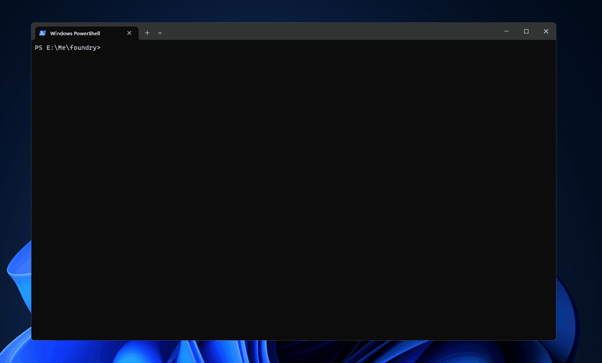

# Chinese-LLaMA-Alpaca-Docker

[Chinese-LLaMA-Alpaca](https://github.com/ymcui/Chinese-LLaMA-Alpaca) 的全容器化部署方式，使用 [llama.cpp](https://github.com/ggerganov/llama.cpp)。

你可以在Docker容器内实现以下所有操作，无需在本地安装环境。

- 转换原始模型权重到HF格式
- 合并LoRA权重
- 量化模型
- 推理部署

## 演示

第一次启动容器加载模型，时间会比较久。



## 快速开始

> [>> 完整操作示例](./docs/README.md)

### 先决条件

- Docker环境，基于WSL2的Docker环境下需要修改`~/.wslconfig`配置，默认配置内存为8G。

- 足够的内存和磁盘空间，裸机7B模型需要13-15G，基于WSL2的Docker环境下，7B模型大约需要15-20G内存。

- 务必确认基本模型和下载的LoRA模型完整性，原版LLaMA包含：`tokenizer.model`、`tokenizer_checklist.chk`、`consolidated.*.pth`、`params.json`。

### Step1: 将原版LLaMA模型转换为HF格式

- 复制一份配置文件`.env-template`到`.env`

- 你的原始`./models`目录结构应该和下面一致

```
./models/llama/7B
├── 7B
│   ├── checklist.chk
│   ├── consolidated.00.pth
│   ├── params.json
│   └── tokenizer_checklist.chk
└── tokenizer.model

1 directory, 5 files
```

- 创建所需要的其他文件夹
```
$ docker-compose --profile init-dir up
```

- 运行转换命令
```
docker-compose --profile models-convert up
```

### Step2: 合并LoRA权重，生成全量模型权重

把对应的LoRA放入LoRA文件夹，这是演示为`Chinese-Alpaca-Plus`，需要两个LoRA，并且有顺序要求

- 放入LoRA后的目录结构
```
./models/llama/7B
├── 7B
│   ├── checklist.chk
│   ├── consolidated.00.pth
│   ├── params.json
│   └── tokenizer_checklist.chk
├── 7B-HF
│   ├── config.json
│   ├── generation_config.json
│   ├── pytorch_model-00001-of-00002.bin
│   ├── pytorch_model-00002-of-00002.bin
│   ├── pytorch_model.bin.index.json
│   ├── special_tokens_map.json
│   ├── tokenizer.json
│   ├── tokenizer.model
│   └── tokenizer_config.json
├── Chinese-Alpaca-Plus
│   └── 7B
├── LoRA
│   ├── chinese-alpaca-plus-lora-7b
│   │   ├── README.md
│   │   ├── adapter_config.json
│   │   ├── adapter_model.bin
│   │   ├── special_tokens_map.json
│   │   ├── tokenizer.model
│   │   └── tokenizer_config.json
│   └── chinese-llama-plus-lora-7b
│       ├── README.md
│       ├── adapter_config.json
│       ├── adapter_model.bin
│       ├── special_tokens_map.json
│       ├── tokenizer.model
│       └── tokenizer_config.json
└── tokenizer.model

7 directories, 26 files
```

- 运行合并命令

```
$ docker-compose --profile models-merge up
```

### Step3: 生成量化版本模型

初始化量化目录结构
```
$ docker-compose --profile init-dir-quantize up
```

把模型转换为GGML的FP16格式
```
$ docker-compose --profile llama-cpp-models-convert up
```

量化4位模型
```
$ docker-compose --profile llama-cpp-quantize up --build
```

### Step4：加载量化后的模型
```
$ docker run -it -v ./models:/app/models -e LC_ALL=zh_CN.utf8 llama.cpp:full-zh ./main -m /app/models/llama/7B/Chinese-Alpaca-Plus/7B/ggml-model-q4_0.bin --color -f prompts/alpaca.txt -ins -c 2048 --temp 0.2 -n 256 --repeat_penalty 1.1
```

## 致谢

此项目本质是以下文档内操作的容器化，如果有疑难问题无法解决，可以查看原文档。

[facebookresearch/llama](https://github.com/facebookresearch/llama)

[ymcui/Chinese-LLaMA-Alpaca](https://github.com/ymcui/Chinese-LLaMA-Alpaca)

- [手动模型合并与转换](https://github.com/ymcui/Chinese-LLaMA-Alpaca/wiki/%E6%89%8B%E5%8A%A8%E6%A8%A1%E5%9E%8B%E5%90%88%E5%B9%B6%E4%B8%8E%E8%BD%AC%E6%8D%A2)

- [llama.cpp量化部署](https://github.com/ymcui/Chinese-LLaMA-Alpaca/wiki/llama.cpp%E9%87%8F%E5%8C%96%E9%83%A8%E7%BD%B2)

[ggerganov/llama.cpp](https://github.com/ggerganov/llama.cpp)

## 免责声明
请严格遵循相应的开源协议。

## 问题反馈

- 如有问题，请在GitHub Issue中提交。

- 在提交问题之前，请先查在Issue搜索是否有类似问题。

- 提交Issue信息时请先整理好你的问题，包括但不限于环境、版本、操作、日志等。

